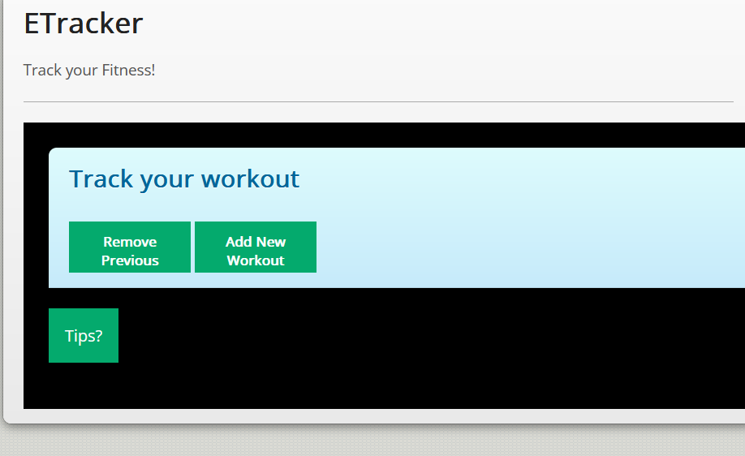
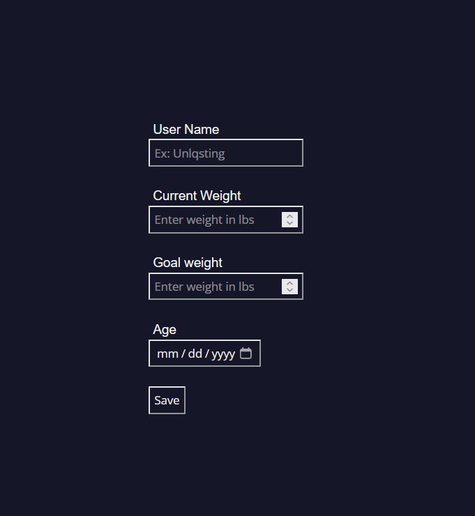

# My contributions to the CTP project
> this blog contains my contributions to the project
- toc: true
- badges: true
- categories: [CTP(tri2), week21, hacks(tri2)]
- title: CPT contributions

# My contributions to the team:

### **This is the first thing** I helped create. This is the workout tracker. I made this using plain old HTML and SASS. I also used javascript to create a dynamic button that generates a workout log when clicked. 

-----------------------

### **The second thing** I contributed to the team was the sign-up page. I made this using HTML, SASS, and javascript. The sign-up page is basically a form that allows the user to input their data and allows the user to submit their data. 

-----------------------

### **The third thing** I contributed to the team is the user-customization page. The user-customization page allows the user to customize their profile. This includes the ability to change their username, password, and email. It also allows the user to change their physical attributes such as height, weight, and age. This is made using HTML, SASS, and javascript. It is currently in very early stages of development.

