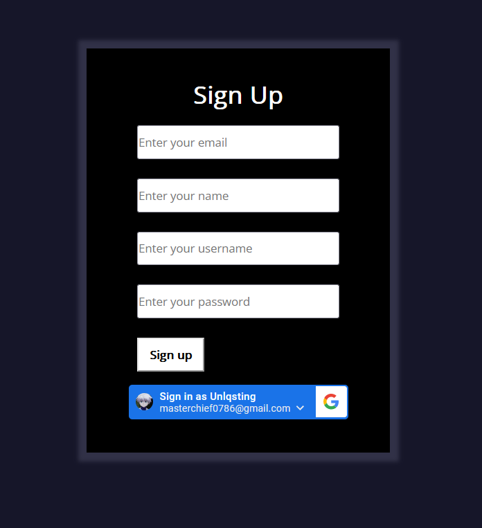

# Tangible artifacts
> this blog contains the current tangible artifact, full stack
- toc: true
- badges: true
- categories: [CTP(tri2), week21, hacks(tri2)]
- title: Tangible artifacts

# 
#### **This is my tangible artifact. This includes a fully interactive sign-up user interface that allows the user to post their data.**

#### **This is my full stack.**

#### **api code**

When a user inputs their data into the frontend of the application, they have the ability to submit this information by clicking the submit button. Upon doing so, the data is posted to the backend where it undergoes processing. The first step in this process is the conversion of the data from an HTML encoded form to a JSON formatted structure. This conversion is crucial as it allows for the easy transfer and storage of data within the system.

Once the data has been converted, it is then processed and the result is returned to the user in JSON format. This allows for easy display of the result and provides a clear understanding of what information has been processed and returned.

The goal is to create a full CRUD (Create, Read, Update, Delete) system, where the user can directly manipulate their data. This is currently in progress and is a top priority to ensure that the system is user-friendly and efficient. The CRUD system will allow users to add new data, view their existing data, update existing data, and delete data if necessary, all from within the frontend of the application